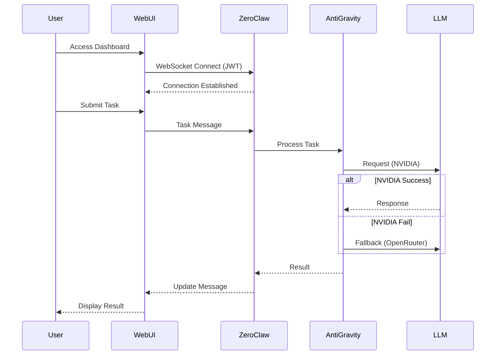

# System Architecture

## 2. System Architecture

### 2.1 High-Level Architecture Diagram

```
┌─────────────────────────────────────────────────────────────────┐
│                    USER ACCESS LAYER                           │
│  ┌──────────────┐    ┌──────────────┐    ┌──────────────┐     │
│  │  Desktop Web  │    │  Mobile Web  │    │   Telegram   │     │
│  │  (Next.js)   │    │  (Next.js)   │    │    (Bot)     │     │
│  └──────┬───────┘    └──────┬───────┘    └──────┬───────┘     │
│         │                   │                   │             │
│         └───────────────────┼───────────────────┘             │
│                             │                                 │
┌─────────────────────────────┼─────────────────────────────────┐
│                             ▼                                 │
│              ┌─────────────────────────┐                      │
│              │   PUBLIC NODE (AWS EC2)  │                      │
│              │   - 4GB RAM              │                      │
│              │   - Nginx Reverse Proxy  │                      │
│              │   - Basic Auth / OIDC    │                      │
│              └───────────┬─────────────┘                      │
│                          │                                     │
┌───────────────────────────┼───────────────────────────────────┐
│  SECURE BRIDGE             ▼                                   │
│  (Tailscale VPN)   ┌─────────────────────────┐                │
│  - Mesh Network     │  PRIVATE NODE (Home PC)  │                │
│  - Deny-by-Default │  - 24/7 System          │                │
├─────────────────────┼─────────────────────────┤                │
│                     │                         │                │
│  ZEROCLAW DAEMON    │  SERVICES               │                │
│  ┌──────────────┐  │  ┌──────────────┐      │                │
│  │ Rust Runtime │  │  │ AntiGravity  │      │                │
│  │ - WebSocket  │◄─┼──│  Router      │      │                │
│  │ - JWT Auth   │  │  │  (Python)    │      │                │
│  │ - Metrics    │  │  │ - LLM Fallback│      │                │
│  └──────────────┘  │  └──────────────┘      │                │
│                    │  ┌──────────────┐      │                │
│                    │  │ MCP Memory    │      │                │
│                    │  │  (Node.js)    │      │                │
│                    │  └──────────────┘      │                │
│                    │  ┌──────────────┐      │                │
│                    │  │ Docker MCP   │      │                │
│                    │  │  Worker       │      │                │
│                    │  └──────────────┘      │                │
│                    └─────────────────────────┘                │
└───────────────────────────────────────────────────────────────┘
```

### 2.2 Split-Brain Model

The architecture separates concerns into two distinct physical environments:

**Public Node (Gateway/Brain)**
- **Location:** AWS EC2 instance with 4GB RAM
- **Responsibility:** Serves as Next.js frontend to users
- **Security:** Protected by Nginx reverse proxy with Basic Auth/OIDC
- **Network:** Only has outbound access to private node via Tailscale VPN

**Private Node (Brain and Muscles)**
- **Location:** Home PC running 24/7
- **Responsibility:** All heavy computation, file operations, and agent orchestration
- **Services:** ZeroClaw Daemon, AntiGravity Router, MCP Memory, Docker MCP
- **Security:** No SSH access from public node; only specific HTTP/WebSocket ports exposed

### 2.3 Communication Flow



### 2.4 Plugin Architecture

```
┌─────────────────────────────────────────────────────────┐
│                    WEB UI CORE                          │
│  ┌─────────────────────────────────────────────────┐   │
│  │            Plugin Registry                      │   │
│  │  - Register plugins                             │   │
│  │  - Manage lifecycle                             │   │
│  │  - Status tracking                              │   │
│  └───────────────┬─────────────────────────────────┘   │
│                  │                                      │
│  ┌───────────────┼─────────────────────────────────┐   │
│  │               ▼                                 │   │
│  │  ┌─────────────────────────────────────┐       │   │
│  │  │         PLUGIN MANAGER              │       │   │
│  │  │  - Dynamic loading                  │       │   │
│  │  │  - Error boundaries                 │       │   │
│  │  │  - Isolation (iframe/sandbox)       │       │   │
│  │  └─────────────────────────────────────┘       │   │
│  └───────────────┬─────────────────────────────────┘   │
└──────────────────┼───────────────────────────────────────┘
                   │
        ┌───────────┼───────────┐
        │           │           │
        ▼           ▼           ▼
┌──────────┐ ┌──────────┐ ┌──────────┐
│ TLDraw   │ │ Canvas   │ │ Custom   │
│ Canvas   │ │ Plugin   │ │ Plugin   │
│ (Built-in)│ │ (Sandbox)│ │          │
└──────────┘ └──────────┘ └──────────┘
```

---

**Next:** [System Requirements](03-system-requirements.md)
